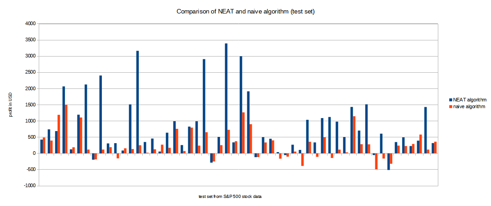

# StockTradingWithNeatAlgorithm
 Stock trading based on MACD indicator using NEAT and naive algorithm

## Sections

 - [Description](#description)
	 - [General](#general)
	 - [MACD description](#MACD-description)
	 - [Data Preparation](#data-preparation)
	 - [Main features](#main-features)
	 - [NEAT vs naive algorithm](#NEAT-vs-naive-algorithm)
 - [Usage](#usage)
 - [Links](#links)

## Description

### General
In this project, NEAT algorithm is used for stocks trading. It makes use of MACD indicator to decide whether to buy or sell stocks. Implemented bookmaker has a starting capital of 1000 USD and it tries its hand in trading stocks of S&P 500 stock data (link to a dataset is below). Because of the fact that NEAT algorithm tries to make intelligent decisions, I have also decided to implement naive algorithm (which is also using MACD to making decisions) in order to have some reference point.

### MACD description
Moving Average Convergence Divergence (MACD) is a trend-following momentum indicator, which is considered the most simple and effective one. It is mainly used in technical analysis of stock prices. It shows the relationship between two exponential moving averages and consists of two charts: MACD and SIGNAL.

MACD can be interpreted in many ways. One of them (which is exploited in this project) says that there is going to be a downward trend, when MACD line crosses SIGNAL line from the top, and that there is going to be an upward trend when SINGAL line is corssed from the bottom by MACD line.

Like any forecasting algorithm, MACD is not perfect, because it can generate false signals. However, it is very useful, especially with long-term investments.

### Data Preparation
Data used in this project comes from kaggle S&P 500 stock data (link is below). To train agent, I had to calculate MACD and SIGNAL values for each chart. Then I divided data set into train and test set in 90 to 10 ratio.

### Main features
  - using NEAT algorithm to trade stocks
  - using naive algorithm to trade stocks
  - MACD and SIGNAL
  - S&P 500 stock data

### NEAT vs naive algorithm

## Usage
 - University Project

## Links
 - https://www.kaggle.com/camnugent/sandp500 (S&P 500 stock data)
